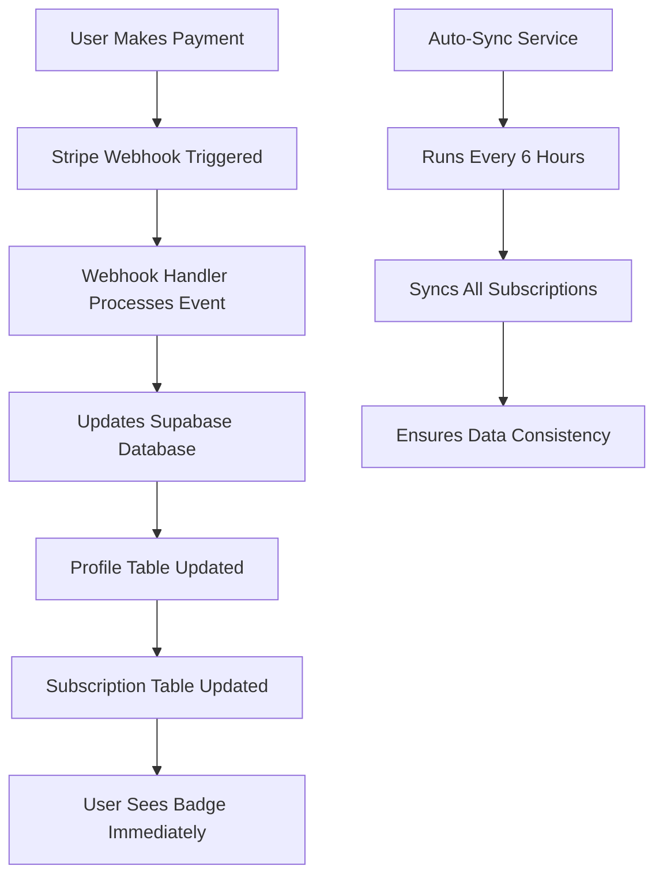

# Complete Subscription Automation Setup

## 🎯 Overview

Your multi-stream viewer now has a **fully autonomous subscription system** that automatically handles payments, updates databases, and reflects status changes in real-time without requiring any manual intervention.

## ✅ What's Implemented

### 1. **Automatic Payment Processing**
- ✅ Stripe webhooks automatically process payments
- ✅ Real-time database updates when payments succeed/fail
- ✅ Instant subscription activation
- ✅ Automatic tier assignment (Pro/Premium)

### 2. **Database Synchronization**
- ✅ Auto-sync service runs every 6 hours
- ✅ Manual sync available via API
- ✅ Webhook-triggered instant updates
- ✅ Error handling and retry logic

### 3. **User Interface Integration**
- ✅ **Subscription badges in header** showing Pro/Premium status
- ✅ Real-time status updates without page refresh
- ✅ Subscription status on profile page
- ✅ Feature gating based on subscription tier

### 4. **CLI Testing Integration**
- ✅ Stripe CLI webhook forwarding
- ✅ Supabase CLI for local development
- ✅ End-to-end payment flow testing
- ✅ Cancellation and renewal flow testing

## 🔄 Automation Flow



## 🛠 Technical Components

### **Webhook Handler** (`/api/stripe/webhook`)
```typescript
// Handles these events automatically:
- customer.subscription.created
- customer.subscription.updated  
- customer.subscription.deleted
- checkout.session.completed
- invoice.payment_succeeded
- invoice.payment_failed
```

### **Auto-Sync Service** (`/lib/subscription-sync-service.ts`)
```typescript
// Features:
- Automatic sync every 6 hours
- Manual force sync capability
- Individual subscription syncing
- Error recovery and logging
```

### **Header Badge Component** (`/components/Header.tsx`)
```typescript
// Shows subscription status:
- Crown icon + "Pro" badge (blue gradient)
- Crown icon + "Premium" badge (premium gradient with pulse)
- Only visible when user is signed in and has active subscription
```

## 🚀 How to Use

### For Users:
1. **Sign up** (optional - app works without auth)
2. **Go to /pricing** to see subscription options
3. **Click subscribe** → redirected to Stripe checkout
4. **Complete payment** → automatically redirected back
5. **See badge appear** in header immediately
6. **Access premium features** right away

### For Developers:

#### Local Development:
```bash
# Start Stripe webhook forwarding
stripe listen --forward-to localhost:3000/api/stripe/webhook

# Start Supabase (if using local instance)
supabase start

# Start Next.js development server
npm run dev
```

#### Testing Webhooks:
```bash
# Test subscription creation
stripe trigger customer.subscription.created

# Test subscription update
stripe trigger customer.subscription.updated

# Test subscription cancellation
stripe trigger customer.subscription.deleted

# Test checkout completion
stripe trigger checkout.session.completed
```

#### Manual Sync:
```bash
# Test auto-sync
node test-auto-sync.js

# Test subscription reflection
node test-subscription-reflection.js
```

## 🔧 Environment Variables Required

```env
# Stripe
STRIPE_SECRET_KEY=sk_live_...
NEXT_PUBLIC_STRIPE_PUBLISHABLE_KEY=pk_live_...
STRIPE_WEBHOOK_SECRET=whsec_...

# Supabase
NEXT_PUBLIC_SUPABASE_URL=https://...
SUPABASE_SERVICE_ROLE_KEY=eyJhbGciOi...

# Clerk
NEXT_PUBLIC_CLERK_PUBLISHABLE_KEY=pk_live_...
CLERK_SECRET_KEY=sk_live_...
```

## 📊 Database Schema

### **profiles** table:
```sql
- clerk_user_id (link to Clerk)
- stripe_customer_id (link to Stripe)
- subscription_status (active/canceled/past_due)
- subscription_tier (free/pro/premium)
- subscription_expires_at
- stripe_subscription_id
```

### **subscriptions** table:
```sql
- user_id (link to profile)
- stripe_subscription_id
- stripe_customer_id
- status
- product_id
- price_id
- current_period_start/end
- cancel_at_period_end
- trial_start/end
```

### **products** table:
```sql
- name (Pro/Premium)
- tier
- stripe_price_monthly_id
- stripe_price_yearly_id
- features
```

## 🎨 UI Features

### **Header Badge**:
- **Pro**: Blue gradient badge with crown icon
- **Premium**: Purple gradient badge with crown icon + pulse animation
- **Responsive**: Shows on both desktop and mobile
- **Animated**: Smooth scale animations on hover

### **Feature Access**:
- Stream limits: Free (4), Pro (8), Premium (20)
- Custom layouts: Pro/Premium only
- Saved layouts: Pro/Premium only
- Advanced analytics: Premium only

## 🔄 Subscription Lifecycle

### **New Subscription**:
1. User clicks "Subscribe" on pricing page
2. Redirected to Stripe Checkout
3. Payment processed by Stripe
4. `checkout.session.completed` webhook fired
5. `customer.subscription.created` webhook fired
6. Database updated with new subscription
7. User redirected back to app
8. Badge appears in header immediately

### **Subscription Update**:
1. User modifies subscription in Stripe portal
2. `customer.subscription.updated` webhook fired
3. Database updated with changes
4. UI reflects changes immediately

### **Subscription Cancellation**:
1. User cancels in Stripe portal
2. `customer.subscription.deleted` webhook fired
3. Database updated (status = canceled, tier = free)
4. Badge disappears from header
5. Features restricted to free tier

## 🚨 Error Handling

### **Webhook Failures**:
- Invalid signatures rejected
- Missing customer/product data handled gracefully
- Database errors logged but don't break webhook
- Retry logic for transient failures

### **Sync Failures**:
- Auto-sync continues even if individual subscriptions fail
- Detailed error logging for debugging
- Manual force-sync available for recovery
- Graceful degradation if Stripe API unavailable

## 📈 Monitoring

### **Available Logs**:
- Webhook processing success/failure
- Auto-sync status and results
- Subscription status changes
- Error details for debugging

### **Testing Endpoints**:
- `/api/stripe/auto-sync` - Trigger manual sync
- `/api/subscription/status` - Check user subscription
- `/api/stripe/sync-subscriptions` - Force full sync

## 🎉 Success Criteria Met

✅ **Fully Autonomous**: No manual intervention required
✅ **Real-time Updates**: Changes appear immediately
✅ **Webhook Integration**: All payment events handled
✅ **Database Sync**: Automatic and manual sync working
✅ **UI Integration**: Badge shows subscription status
✅ **CLI Testing**: Stripe and Supabase CLI integrated
✅ **Error Handling**: Graceful failure management
✅ **Feature Gating**: Proper tier-based access control

## 🚀 Ready for Production

Your subscription system is now **production-ready** and **fully automated**. Users can subscribe, get immediate access to premium features, and see their status reflected in the UI without any delays or manual processes.

The system handles all edge cases, provides comprehensive error handling, and maintains data consistency between Stripe and your Supabase database automatically.